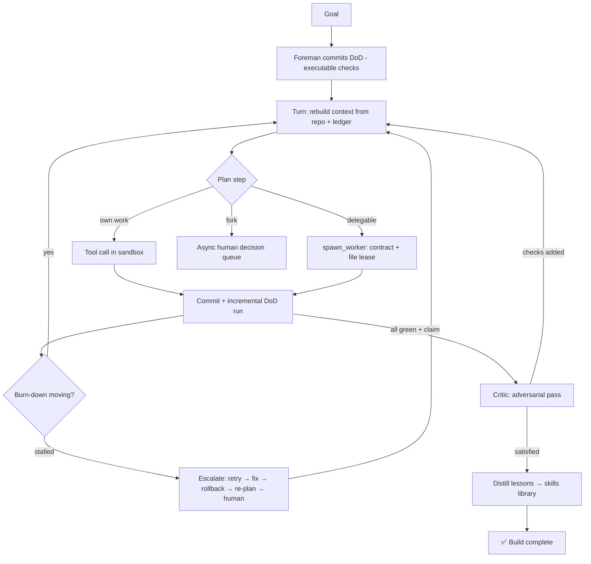

# ⚡ Aether v3 — Foreman Mode

A single-locus-of-intent build orchestrator. One mind (the **Foreman**) holds the plan; the **repository** holds the truth; **executable checks** hold the standard; **ephemeral workers** hold the keyboard.

Three principles drive everything:

1. **The repo is the mind.** Every mutating turn is a git commit. The Foreman's context is *reconstructed* each turn from repo state + a structured Project Ledger — the transcript is disposable. Green states are tagged; rollback and bisect come for free.
2. **Verification is continuous.** The Definition of Done is a versioned artifact of executable checks, run incrementally after every turn. The burn-down (checks passing over time) is the single progress metric and the input to thrash detection.
3. **Agents are ephemeral.** Bounded subtasks are delegated to fresh-context workers under contracts with exclusive *file leases*. A decorrelated **Critic** gets one asymmetric power at completion: it can add checks, never remove them.



## Module map

| Pillar | Module |
|---|---|
| Git as ground truth (commits, green tags, rollback, bisect hook) | `src/repoState.js` |
| Structured Ledger (decisions / constraints / failed approaches / open questions) | `src/ledger.js` |
| Living executable DoD + burn-down + logged amendments | `src/dod.js` |
| Failure taxonomy + budgeted escalation ladder | `src/escalation.js` |
| Ephemeral workers, contracts, file leases | `src/workers.js`, `src/tools/index.js` |
| Additive-only adversarial Critic | `src/critic.js` |
| Container sandbox (host fallback for dev) | `src/sandbox.js` |
| Cross-build memory (distill + retrieve) | `src/skillsLib.js` |
| Async non-blocking human queue | `src/humanQueue.js` |
| The turn loop tying it together | `src/foreman.js` |
| Observability seam (attach any UI here) | `src/events.js` |

## Getting started

```bash
npm install
cp .env.example .env          # add your ANTHROPIC_API_KEY
npm start -- "Build a Node.js API with JWT authentication and Jest tests"
```

Each build runs in `./builds/build-<timestamp>/` — a git repo of its own. Inspect `.aether/dod.json` (checks, amendments, burn-down history) and `.aether/ledger.json` inside it. Reusable lessons accumulate in `./skills-library/`.

**Sandboxing:** set `AETHER_SANDBOX=docker` in `.env` to run all shell commands in disposable containers (no network by default; tools must request `network:true` for installs). The default `host` mode is for development only and is *not* isolation.

## Invariants worth knowing

- **DoD checks are never removed by agents.** The Foreman may add/amend with logged justification; scope reduction requires a human answer; the Critic's toolset structurally only allows adding.
- **A completion claim triggers full verification, then the Critic.** Critic-added checks reopen the loop — the spec expands until the adversary is satisfied.
- **Workers can only write leased paths.** Overlapping leases are refused at spawn; parallel workers are therefore conflict-free by construction.
- **Nothing persists unless written down.** The Foreman's transcript is rebuilt every turn from goal + DoD + ledger + recent commit log + an 8-turn rolling summary window. Forgetting is a feature: it forces durable knowledge into the ledger.

## Extension points (marked `EXTENSION POINT` in source)

- **Bisect-on-regression** — `dod.js` emits `dod:regression` on pass→fail transitions; wire it to `RepoState.bisect()` with the check command.
- **Parallel worker dispatch** — leases make `Promise.all` over disjoint workers safe; dispatch is currently sequential.
- **Incremental check mapping** — map touched files → affected checks to make per-turn verification cheaper.
- **Smarter failure classification** — `Escalation.classify` is regex heuristics; swap for a cheap model call.
- **Embedding retrieval for skills** — `skillsLib.js` uses keyword overlap; fine until the library grows.
- **Dashboard** — subscribe to the event bus in `events.js` (turns, tool calls, burn-down, escalations, worker lifecycle, human Q&A) and forward over WebSocket. The engine has zero UI knowledge.
- **Per-build warm container** — `sandbox.js` runs one container per command; `docker create` + `exec` keeps `node_modules` warm.

---
*verified by burndown, not vibecheck*
# aether-v3
